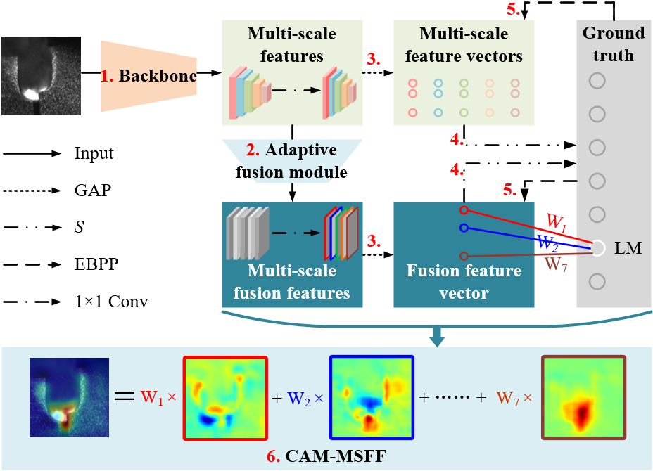

# CAM-MSFF

### Introduction

- CAM-MSFF uses VGG16 as a skeleton network to extract the multi-scale features of the molten pool/keyhole image. 
- The features of the five scales extracted by VGG16 are adaptively fused. 
- The global average pooling (GAP) operation is used to obtain feature vectors of multi-scale features and fusion features. 
- The feature vectors are mapped to the probability value corresponding to the output class through the Softmax function.
- Both multi-scale features and fusion features are supervised by labels to encourage the model to learn and utilize multi-scale features. 



### Training 

```python
pip install -r requirements.txt
python train.py --train-path "./my_dataset/train" --val-path "./my_dataset/val" --batch-size 8
```

### Evaluation

```python
# CHANGE THE PATH:
state_dict = torch.load('model_pth/best_acc.pth')
# AND
test_valid = datasets.ImageFolder(root='./dataset/test/',
# TO YOUR OWN PATH, THEN RUN
python test.py
```
